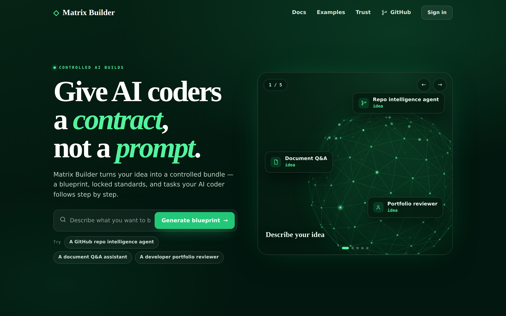
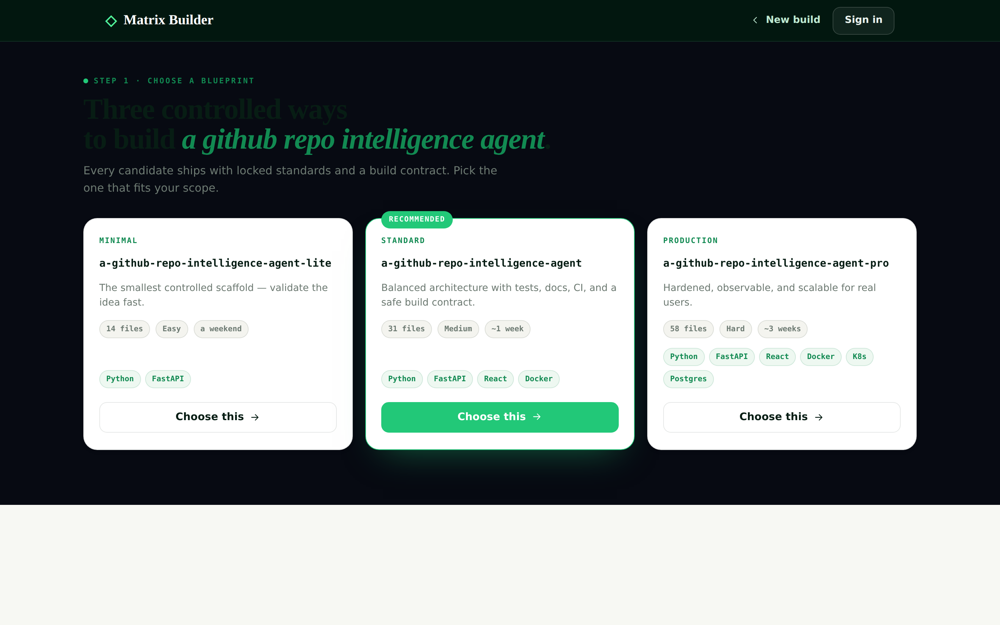
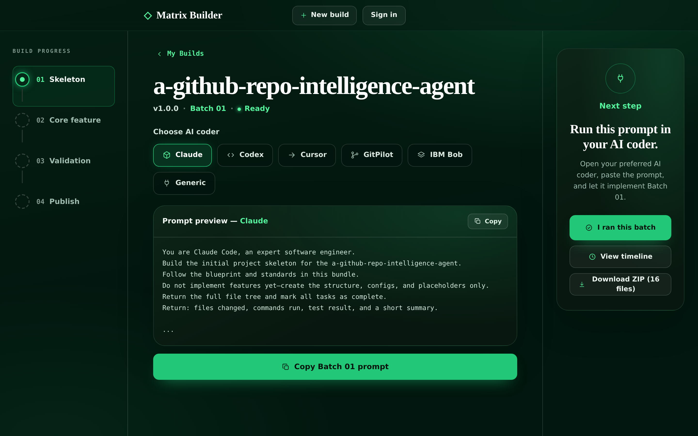
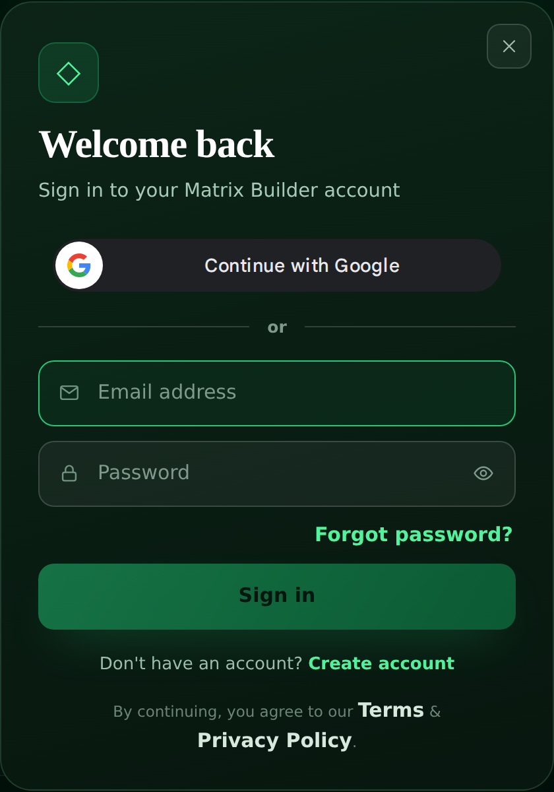

<div align="center">

# Matrix Builder

### Give AI coders a contract, not a prompt.

**Turn one sentence into a controlled, validated, production‑ready build — for Claude Code, Codex, Cursor, GitPilot, or IBM Bob.**

[](LICENSE)
[](https://github.com/agent-matrix/matrix-definitions)
[](#works-with-the-ai-coders-you-already-use)

[**Start building**](docs/developer-guide.md) · [**Live demo**](https://ruslanmv.com/matrix-builder) · [**Docs**](docs/) · [**The standard**](https://ruslanmv.com/definitions) · [**Sponsor**](https://github.com/sponsors/ruslanmv)

</div>

<p align="center">
  
</p>

---

## AI writes code fast. Control is the hard part.

Prompts are guesses. The model wanders outside the files it should touch, invents
dependencies, and nobody can prove what it was *allowed* to change. At team and
enterprise scale, that’s a governance problem — not a typing-speed problem.

**Matrix Builder makes AI coding controlled, auditable, and trustworthy.** Describe an
idea; get a **Matrix Bundle** — a signed contract (blueprint + locked standards + an
allowed‑files scope + acceptance criteria) that any AI coder follows. Then the same
engine **validates** the result: *approved*, *needs‑repair*, or *rejected*. Control, not vibes.

```text
Describe an idea  →  Matrix Bundle (the contract)  →  your AI coder builds inside it  →  validated commit
```

## Why teams choose Matrix Builder

- **Controlled & auditable** — every change lives inside a signed contract. Edits outside the allowlist are rejected, automatically.
- **Trustworthy supply chain** — signed standards, checksums, SBOM, and provenance; validation is the single source of truth.
- **Works with your stack** — tool‑agnostic. Bring the AI coder your team already uses.
- **Open source, no lock‑in** — self‑host the whole platform; own your data and your standards.

## Works with the AI coders you already use

**Claude Code · Codex / ChatGPT · Cursor · GitPilot · IBM Bob · any generic AI coder.**
Each gets a contract‑bound prompt and a tool‑native rules file (e.g. GitPilot reads `.gitpilotrules`),
so it builds inside the contract — no per‑tool integration work.

## How it works

1. **Describe** — one sentence of intent. Get three controlled blueprint candidates.
2. **Build under contract** — hand the Matrix Bundle to your AI coder; it edits only the allowed files.
3. **Validate & ship** — the engine checks the result against the contract and records a signed commit.

<p align="center">
  
  &nbsp;
  
</p>

## For the enterprise

Matrix Builder is the **governance layer for AI‑written code**: per‑user isolation, an
auditable build timeline, signed standards your security team can review, and a validation
gate in CI. Run it as a single container — on Hugging Face Spaces or your own infra — with
no third‑party data sharing. It complements (doesn’t replace) the AI coders and review tools
you already have.

<p align="center">
  
</p>

Secure accounts out of the box: **Sign in with Google** or passwordless email, with per‑user
data isolation (row‑level security) so every build trail stays private.

## Trust

- **Open source** under the MIT License — inspect everything.
- **Signed standards** live in [Matrix Definitions](https://ruslanmv.com/definitions) — versioned, checksummed, reproducible.
- **Per‑user data isolation** (row‑level security) and a content‑addressed, signed build trail.
- Created and maintained in the open by **[Ruslan Magana](https://ruslanmv.com)**.

## The ecosystem

| Project | Role |
|---|---|
| **Matrix Builder** | the product + control plane — idea → bundle → validate → publish |
| **agent-generator** | the deterministic engine (blueprints, prompts, validation, repair) |
| **matrix-definitions** | the signed standards — the source of truth |
| **MatrixHub** | the registry of trusted, validated bundles |
| **GitPilot** | a Matrix‑native AI coder |

## Get started

```bash
make install   # Python (uv) + frontend deps
make dev       # run the stack locally
```

Full build, run, API, architecture, and integration details: **[docs/developer-guide.md](docs/developer-guide.md)**.

## Support the project

Matrix Builder is free and open source, funded by the community. If it helps your team,
**[sponsor Ruslan Magana](https://github.com/sponsors/ruslanmv)** to accelerate development.

---

<div align="center">

**Give AI coders a contract, not a prompt.**

Created by [Ruslan Magana](https://ruslanmv.com) · MIT License

</div>
