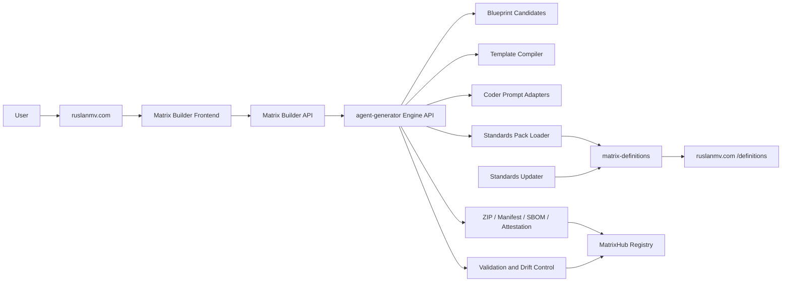
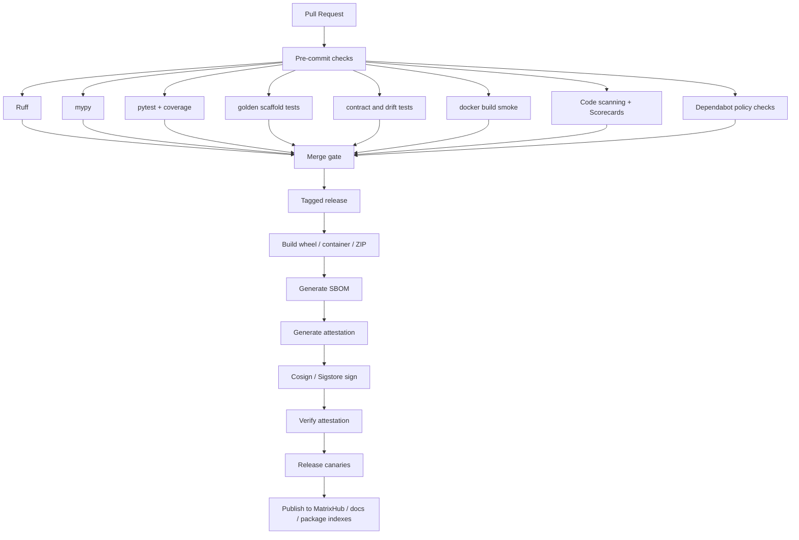

# Production Architecture for Agent Generator as the Matrix Builder Engine

## Executive summary

The existing `ruslanmv/agent-generator` repository is already strong enough to become the internal backend engine for Matrix Builder without a rewrite. The public repo already exposes a broad monorepo surface with `.github/workflows`, `backend`, `frontend`, `observability`, `deploy/helm`, `src/agent_generator`, `tests`, `e2e`, and `examples`; the README describes it as a two-surface repo with a pip-installable CLI plus a platform stack, current support for CrewAI, LangGraph, WatsonX Orchestrate, CrewAI Flow, and ReAct, a web UI, Docker packaging, signed CI builds, and Helm deployment. That combination is unusual for an early generator and makes “harden and separate responsibilities” the correct strategy. citeturn13view0turn36view0turn36view1turn36view2turn36view3

The product should therefore be split conceptually, not rebuilt from zero: **Matrix Builder** becomes the public control plane and UX, **agent-generator** stays the internal engine, **matrix-definitions** becomes the signed machine-readable policy source, **MatrixHub** becomes the registry for trusted outputs, and **Ruslan Magana Definitions** become the public named standard that explains how and why the engine constrains AI coding. This matters because NIST SSDF is explicitly outcome-oriented rather than tool-prescriptive, OWASP ASVS provides a developer requirements baseline, OWASP Top Ten 2025 remains the current application-security awareness baseline, OWASP’s GenAI and Agentic initiatives now cover AI-specific risks such as prompt injection, supply-chain issues, improper output handling, excessive agency, and system prompt leakage, and SLSA/GitHub attestation guidance provide the right supply-chain backbone for release evidence. citeturn25view0turn2view1turn22view0turn31view0turn32view0turn33view0turn34view0turn40view0turn28view1

The core differentiator is not “better prompts.” It is a **contracted generation system**: idea parsing, blueprint candidates, a pinned standards pack, `MATRIX_BLUEPRINT.yaml`, `MATRIX_STANDARDS.lock`, allowed-file boundaries, coder-specific prompt packs, validation, repair prompts, and signed export artifacts. GitHub’s own attestation guidance is a good model here: provenance is valuable, but it only improves security if it is verified and evaluated against policy; attestations alone are not proof that an artifact is secure. Matrix Builder therefore needs both signed provenance and policy validation. citeturn41view0

If team size remains unspecified, the most realistic planning assumption is two engineers plus part-time DevSecOps/SRE and security review. Under that assumption, a serious MVP can be delivered in roughly **12–15 weeks**; if one founder fills all roles, the plan is still feasible, but the schedule should be treated as materially longer. This also preserves the previously agreed control-first sequencing for the project. fileciteturn0file0

| Decision | Recommendation |
|---|---|
| Public product name | **Matrix Builder** |
| Internal engine name | **agent-generator** |
| Source of truth for rules | **matrix-definitions** |
| Registry for trusted artifacts | **MatrixHub** |
| Public named standard | **Ruslan Magana Definitions (RMD)** |
| First engineering target | **Fix `agent-generator` first** |
| First product promise | **“AI coders under contract, not random codegen.”** |

## Analytical report

### Current-state analysis

The current repository already behaves like a monorepo platform, not just a CLI toy. The public tree shows `backend`, `frontend`, `observability`, `deploy/helm`, `.github/workflows`, `src/agent_generator`, `tests`, `e2e`, and `examples`; the README presents “two surfaces, one repo,” where the CLI remains installable by `pip`, while the platform bundles FastAPI, a Vite SPA, desktop/mobile packaging, signed CI builds, and Helm deployment. In addition, `make test` already spans CLI pytest, backend pytest, and frontend type-check/build work. That is enough existing structure to justify a hardening roadmap instead of a replacement roadmap. citeturn13view0turn36view1turn36view2turn36view3

A second important observation is that the repo’s current functionality is already close to the domain Matrix Builder wants. The README explicitly lists multi-framework generation for CrewAI, LangGraph, WatsonX Orchestrate, CrewAI Flow, and ReAct, plus built-in tools such as web search, PDF reading, API calls, SQL queries, file writing, and vector search. The web UI already offers a “describe your agents, pick a framework, download a ZIP” flow. That means the missing piece is no longer “generation ability.” The missing piece is **deterministic control**: versioned rules, stable data models, validation, provenance, and governance. citeturn36view0turn36view1

What is still missing for a production Matrix Builder engine is a clean engine API boundary, an externalized standards pack, a stable blueprint schema, a drift detector, deterministic coder adapters, release evidence, and an updater workflow with human approvals. In short, the repo has enough capabilities, but it does not yet expose them as a governed contract.

| Repository | Action | Priority | Why |
|---|---|---:|---|
| `agent-generator` | **Fix and harden first** | P0 | Already contains the engine, CLI, backend, frontend, tests, workflows, and packaging surfaces |
| `matrix-definitions` | **Build second** | P0 | Must become the signed source of truth for standards, rules, and Ruslan definitions |
| `matrix-builder` | **Build third** | P1 | Public API/UI that calls `agent-generator` and exposes controlled generation |
| `matrixhub` / `matrixhub.io` | **Adapt after MVP** | P2 | Registry for validated blueprints, prompt packs, reports, and remixable templates |
| `ruslanmv.com` | **Adapt after MVP** | P2 | Public docs and publishing surface for the Ruslan Magana standard |

| Priority task | Repo | Why first | Concrete exit condition |
|---|---|---|---|
| Public engine boundary | `agent-generator` | Nothing else should depend on unstable internals | `AgentGenerator` SDK + stable CLI/API facade |
| Standards schema and lock model | `matrix-definitions` + `agent-generator` | Needed before “best practices” can be enforced | Signed standards pack + `MATRIX_STANDARDS.lock` |
| Blueprint compiler | `agent-generator` | Converts ideas into deterministic contracts | One idea → three candidates → one scaffold |
| Validation and drift control | `agent-generator` | This is the product’s core trust layer | Unauthorized edits and dependency drift are rejected |
| Prompt adapters | `agent-generator` | Needed to control Claude/Cursor/Codex | Prompt packs generated from same lock/blueprint |
| Public Matrix Builder API/UI | `matrix-builder` | Needed only after engine is governed | User can create/download/validate blueprint bundles |
| Publishing and docs | `matrixhub`, `ruslanmv.com` | Depends on signed, validated outputs | Public standard pages and registry contract live |
| Standards updater | `matrix-definitions` | Last, because bad automation can break trust | Fetch → diff → PR → review → sign → activate |

### Target architecture

The fastest production design is a **controlled multi-repo system** anchored by the existing `agent-generator` monorepo. You should keep `agent-generator` as the internal engine and admin-grade platform, create `matrix-definitions` as a dedicated policy repo with its own release cadence, and build `matrix-builder` as the separate public product. That separation fits the observable current repo structure while reducing future brand confusion. The repo already combines CLI and platform surfaces; the right change is to make the package boundary explicit inside `src/agent_generator`, not to fragment the current codebase prematurely. citeturn13view0turn36view2



The production storage model should be simple and explicit. Use **PostgreSQL** for metadata such as blueprints, generation runs, validation reports, standards-pack references, and publication records. Use **object storage** for ZIP exports, prompt bundles, manifests, SBOMs, and attestations. Use an **async worker queue** for long-running generation, validation, and publication jobs. For the engine itself, keep the synchronous SDK path available for tests and local development.

| Data model | Key fields | Persistence |
|---|---|---|
| `IdeaRequest` | `idea`, `constraints`, `preferred_stack`, `quality_level` | API payload / ephemeral |
| `BlueprintCandidate` | `candidate_id`, `title`, `stack`, `confidence`, `rationale` | Postgres JSONB |
| `BlueprintSpec` | `blueprint_id`, `slug`, `pages`, `services`, `routes`, `tasks`, `allowed_changes` | Postgres JSONB + export bundle |
| `StandardsPackManifest` | `pack_id`, `version`, `digest`, `sources`, `signature`, `compatibility` | `matrix-definitions` release artifact |
| `GenerationRun` | `run_id`, `blueprint_id`, `pack_id`, `status`, `artifacts`, `trace_id` | Postgres |
| `ValidationReport` | `report_id`, `run_id`, `status`, `violations`, `score`, `repair_prompt` | Postgres JSONB |
| `PublicationRecord` | `publication_id`, `matrixhub_slug`, `lock_digest`, `trust_status` | Postgres + MatrixHub |
| `ArtifactManifest` | `files`, `digests`, `sbom_ref`, `attestation_ref` | Export bundle + object storage |

The engine module additions below are the minimum useful production boundary for the existing repo.

| Path to add or formalize in `agent-generator` | Purpose |
|---|---|
| `src/agent_generator/engine.py` | Public SDK facade used by Matrix Builder |
| `src/agent_generator/blueprints/models.py` | `BlueprintCandidate`, `BlueprintSpec`, `TaskSpec` |
| `src/agent_generator/blueprints/idea_parser.py` | Normalize raw ideas into structured intent |
| `src/agent_generator/blueprints/candidate_generator.py` | Produce ranked blueprint options |
| `src/agent_generator/blueprints/compiler.py` | Compile selected blueprint into controlled scaffold |
| `src/agent_generator/standards/models.py` | Standards pack and rule dataclasses |
| `src/agent_generator/standards/loader.py` | Load packs from local disk, release bundle, or API |
| `src/agent_generator/standards/registry.py` | Resolve active/current pack and compatibility |
| `src/agent_generator/standards/validator.py` | Evaluate blueprint/template against active rules |
| `src/agent_generator/standards/updater.py` | Fetch/diff/PR generator for standards refresh |
| `src/agent_generator/control/contract.py` | Immutable blueprint contract and hash logic |
| `src/agent_generator/control/allowed_changes.py` | Path allowlists and forbidden edit policy |
| `src/agent_generator/control/drift.py` | Architecture and dependency drift detection |
| `src/agent_generator/control/repair.py` | Generate repair prompts from validation violations |
| `src/agent_generator/coder_adapters/claude_code.py` | Claude Code prompt pack |
| `src/agent_generator/coder_adapters/cursor.py` | Cursor prompt pack |
| `src/agent_generator/coder_adapters/codex.py` | Codex prompt pack |
| `src/agent_generator/artifacts/manifest.py` | Build export manifest and digests |
| `src/agent_generator/artifacts/sbom.py` | Produce or attach SBOM into export bundle |
| `src/agent_generator/artifacts/packager.py` | ZIP creation, checksums, signature bundle wiring |
| `src/agent_generator/publishing/matrixhub.py` | Publishing client and registry contract checks |
| `src/agent_generator/telemetry/otel.py` | Trace and metric instrumentation |
| `tests/golden/` | Snapshot tests for scaffold and prompt outputs |
| `tests/canary/` | Standards-update canaries and drift injections |
| `tests/validation/` | Contract and policy enforcement tests |

The repo-level additions should be equally explicit:

| Repo-level addition | Purpose |
|---|---|
| `.github/CODEOWNERS` | Protect workflow, standards, prompt, and release files |
| `.github/workflows/ci-engine.yml` | PR gates for engine code and templates |
| `.github/workflows/release-engine.yml` | Signed release artifacts with SBOM/attestation |
| `.github/workflows/standards-canary.yml` | Run pack-update canaries before merge |
| `docs/architecture/matrix-engine.md` | Human overview of engine boundary |
| `docs/standards/rule-catalog.md` | Human-readable rule catalog generated from packs |
| `backend/app/api/ideas.py` | HTTP idea parsing endpoint |
| `backend/app/api/blueprints.py` | Candidate and generation endpoints |
| `backend/app/api/validation.py` | Validation/report endpoints |
| `backend/app/api/standards.py` | Expose current pack and rule metadata |
| `backend/app/api/publications.py` | MatrixHub publication endpoint |

The API surface should stay small and obvious:

| Method | Endpoint | Purpose |
|---|---|---|
| `GET` | `/health` | Liveness/readiness |
| `GET` | `/api/v1/standards/current` | Active pack and signature metadata |
| `POST` | `/api/v1/ideas/parse` | Normalize idea into intent |
| `POST` | `/api/v1/blueprints/candidates` | Return ranked blueprint options |
| `POST` | `/api/v1/blueprints` | Generate controlled blueprint/scaffold |
| `GET` | `/api/v1/runs/{run_id}` | Inspect generation run metadata |
| `POST` | `/api/v1/runs/{run_id}/prompt/{coder}` | Emit Claude/Cursor/Codex prompt pack |
| `POST` | `/api/v1/validations` | Validate repo/patch against blueprint and lock |
| `POST` | `/api/v1/runs/{run_id}/export` | Build ZIP + manifest + SBOM + signatures |
| `POST` | `/api/v1/publications/matrixhub` | Publish validated artifact to MatrixHub |

Example commands for the engine layer:

```bash
python -m agent_generator.cli candidates \
  --idea "AI app that analyzes GitHub repositories" \
  --quality standard

python -m agent_generator.cli generate \
  --candidate github-repo-intelligence-agent \
  --pack industry-2026.06.12 \
  --out ./dist/github-repo-intelligence-agent

python -m agent_generator.cli validate \
  --blueprint ./dist/github-repo-intelligence-agent/MATRIX_BLUEPRINT.yaml \
  --repo ./dist/github-repo-intelligence-agent

gh attestation verify \
  ./dist/github-repo-intelligence-agent.zip \
  --repo ruslanmv/agent-generator

cosign attest \
  --predicate ./dist/github-repo-intelligence-agent.sbom.cdx.json \
  --type cyclonedx \
  ./dist/github-repo-intelligence-agent.zip
```

### Standards and control model

The standards layer should be the foundation of the entire system. NIST SSDF says secure software development should prepare people/process/technology, protect software from tampering and unauthorized access, produce well-secured releases, and respond to residual vulnerabilities; NIST also says the framework focuses on outcomes, not prescribed tools. OWASP ASVS provides a basis for testing technical security controls and gives developers a list of secure-development requirements, while the current OWASP Top Ten 2025 remains the baseline awareness list for web risk. OWASP’s GenAI project adds current GenAI/LLM risks, and the Agentic Security Initiative explicitly targets autonomous agents and multi-step AI workflows—including the kinds of frameworks your repo already supports. SLSA and GitHub’s artifact-attestation model add provenance, integrity, and verifiable release evidence. Docker, PyPA, GitHub Actions security guidance, Dependabot, Scorecards, and FastAPI security docs give the operational best-practice details that should be compiled into rules. citeturn25view0turn2view1turn22view0turn31view0turn32view0turn33view0turn34view0turn40view0turn4view4turn4view1turn4view2turn3view5turn28view4turn3view3turn26view0turn26view2turn26view3turn3view2turn27view0turn27view1turn27view2turn39view0

A practical rule catalog for the first production release should look like this:

| Rule ID | Requirement | Why it exists | Automated check |
|---|---|---|---|
| `PY-001` | Require `pyproject.toml` | Standard Python packaging metadata and build declaration | Parse `[build-system]`, `requires-python`, `readme`, `license` |
| `DOC-001` | Require `README.md` | Public usage and project description | File exists and referenced in `pyproject.toml` |
| `DOC-002` | Require `docs/architecture.md` and `docs/security.md` | Human-readable architecture and security intent | Files exist and non-empty |
| `ENV-001` | Require `.env.example` | Safe configuration onboarding | File exists, no secret values |
| `DOCKER-001` | Multi-stage build | Reduce final image size and attack surface | Dockerfile stage count > 1 |
| `DOCKER-002` | `.dockerignore` required | Prevent noisy or sensitive build context | File exists |
| `DOCKER-003` | Prefer non-root runtime | Lower privilege in containers | Dockerfile contains `USER` in final stage |
| `GHA-001` | `GITHUB_TOKEN` minimum permissions | Least privilege in CI | Workflow permissions static check |
| `GHA-002` | Pin all third-party actions to full SHA | Immutable action consumption | Regex/AST check in `.github/workflows/*.yml` |
| `GHA-003` | Workflow files protected by CODEOWNERS | Human approval for CI changes | `.github/workflows/*` mapped in `CODEOWNERS` |
| `GHA-004` | OIDC for cloud auth; long-lived cloud secrets avoided | Better secret handling | Detect deployment auth mode |
| `SUP-001` | `dependabot.yml` required | Automated update hygiene | Parse config for ecosystems and interval |
| `SUP-002` | Run Scorecards on default branch | Supply-chain posture check | Workflow existence / SARIF presence |
| `REL-001` | Release artifacts require SBOM | Dependency transparency | `*.sbom.cdx.json` or SPDX present |
| `REL-002` | Release artifacts require attestation | Verifiable provenance | Attestation reference present/verified |
| `APP-001` | Map baseline API/web risks to ASVS and Top Ten | App security baseline | Rule profile per template |
| `AGENT-001` | Prompt-injection boundaries | OWASP LLM01 | Untrusted context segregation + tests |
| `AGENT-002` | Output validation before shell/API/file sinks | OWASP LLM05 | Sink validation required |
| `AGENT-003` | Explicit tool permissions and bounded agency | OWASP LLM06 | Allowed tools declared in blueprint |
| `AGENT-004` | Prevent system-prompt leakage | OWASP LLM07 | No prompt export route; leakage tests |
| `AGENT-005` | Cost/runtime/token bounds | OWASP LLM10 | Budget limits configured |
| `RMD-001` | Blueprint immutable after approval | Ruslan control principle | Hash lock of blueprint/lock files |
| `RMD-002` | AI coder edits only allowed files | Ruslan control principle | Diff path allowlist |
| `RMD-003` | No new dependencies/services without exception | Ruslan control principle | Manifest diff policy |
| `RMD-004` | Publish only validated, signed bundles | Ruslan release principle | MatrixHub contract gate |

A machine-readable standards-pack schema should be small and opinionated:

```json
{
  "$schema": "https://matrixhub.io/schemas/standards-pack.schema.json",
  "type": "object",
  "required": ["pack_id", "version", "kind", "status", "sources", "rules", "signature"],
  "properties": {
    "pack_id": { "type": "string" },
    "version": { "type": "string" },
    "kind": { "enum": ["industry", "ruslan", "matrixhub"] },
    "status": { "enum": ["draft", "stable", "deprecated"] },
    "compatibility": {
      "type": "object",
      "properties": {
        "agent_generator": { "type": "string" }
      }
    },
    "sources": {
      "type": "array",
      "items": {
        "type": "object",
        "required": ["id", "family", "uri", "fetched_at", "digest"],
        "properties": {
          "id": { "type": "string" },
          "family": { "type": "string" },
          "uri": { "type": "string" },
          "fetched_at": { "type": "string", "format": "date-time" },
          "digest": { "type": "string" }
        }
      }
    },
    "rules": {
      "type": "array",
      "items": {
        "type": "object",
        "required": ["id", "path", "severity"],
        "properties": {
          "id": { "type": "string" },
          "path": { "type": "string" },
          "severity": { "enum": ["low", "medium", "high", "critical"] }
        }
      }
    },
    "signature": {
      "type": "object",
      "required": ["type", "bundle_path"],
      "properties": {
        "type": { "enum": ["sigstore"] },
        "bundle_path": { "type": "string" }
      }
    }
  }
}
```

One standards rule in YAML should look like this:

```yaml
id: GHA-002
title: Pin GitHub Actions to full-length commit SHAs
severity: critical
source_refs:
  - github.secure-use.pinned-actions
applies_to:
  files:
    - .github/workflows/*.yml
generator:
  enforce:
    uses_ref: full_commit_sha
validation:
  kind: github_actions_pinned_actions
  fail_on_unpinned: true
documentation:
  rationale: |
    Third-party actions are mutable unless pinned to a full commit SHA.
  remediation: |
    Replace tag references with verified full-length SHAs.
```

A Ruslan Magana Definition should be equally concrete:

```yaml
id: RMD-001
title: Blueprint is immutable after approval
severity: critical
applies_to:
  files:
    - MATRIX_BLUEPRINT.yaml
    - MATRIX_STANDARDS.lock
generator:
  emit:
    - MATRIX_BLUEPRINT.yaml
    - MATRIX_STANDARDS.lock
    - MATRIX_ALLOWED_CHANGES.md
validation:
  kind: immutable_files
  fail_on_change: true
governance:
  owner: ruslan-magana
  exception_process: pull-request-with-expiry
```

A sample `MATRIX_BLUEPRINT.yaml` for the first flagship template:

```yaml
schema_version: 1
blueprint_id: mb_2026_06_12_github_repo_intelligence_001
name: GitHub Repo Intelligence Agent
slug: github-repo-intelligence-agent
idea: Analyze public GitHub repositories and produce architecture, risk, and improvement reports.
quality_level: standard

product:
  type: fullstack
  audience: developers
  public_brand: Matrix Builder
  internal_engine: agent-generator

stack:
  frontend: nextjs
  backend: fastapi
  worker: python
  database: postgres
  auth:
    mode: none

pages:
  - /
  - /analyze
  - /report/:id
  - /about

services:
  - name: frontend
    root: frontend/
  - name: api
    root: backend/
  - name: worker
    root: worker/

api_routes:
  - method: GET
    path: /api/v1/health
  - method: POST
    path: /api/v1/repos/analyze
  - method: GET
    path: /api/v1/reports/{report_id}

required_files:
  - README.md
  - .env.example
  - MATRIX_BLUEPRINT.yaml
  - MATRIX_STANDARDS.lock
  - MATRIX_ALLOWED_CHANGES.md
  - docs/architecture.md
  - docs/security.md

allowed_change_roots:
  - frontend/
  - backend/
  - worker/
  - tests/

forbidden_changes:
  - MATRIX_BLUEPRINT.yaml
  - MATRIX_STANDARDS.lock
  - .github/workflows/
  - deploy/helm/

dependencies:
  allowed_ecosystems:
    - npm
    - pip
    - docker
  denied_packages:
    - firebase-admin
    - eval
    - shelljs

tasks:
  - id: TASK-001
    title: Implement POST /api/v1/repos/analyze
    allowed_files:
      - backend/app/api/repos.py
      - backend/tests/test_repos_api.py
  - id: TASK-002
    title: Build analyze page
    allowed_files:
      - frontend/app/analyze/page.tsx
      - frontend/components/repo-form.tsx

acceptance:
  commands:
    - ruff check backend/
    - mypy backend/
    - pytest -q
    - docker build -t github-repo-intelligence-agent .
```

The companion lock file is what prevents silent standards drift:

```yaml
schema_version: 1
lock_id: lock_2026_06_12_github_repo_intelligence_001
generated_at: "2026-06-12T14:00:00Z"

engine:
  name: agent-generator
  version: "0.2.0"

blueprint:
  blueprint_id: mb_2026_06_12_github_repo_intelligence_001
  digest: "sha256:2aadc2f1..."

standards:
  industry_pack:
    id: industry-2026.06.12
    digest: "sha256:81c1d27b..."
  ruslan_pack:
    id: rmd-core-v1.0.0
    digest: "sha256:bb91d1aa..."
  matrixhub_pack:
    id: matrixhub-template-rules-v1.0.0
    digest: "sha256:0a0f0d3a..."

sources:
  - id: nist-sp-800-218
    digest: "sha256:..."
  - id: owasp-asvs-5.0.0
    digest: "sha256:..."
  - id: owasp-top10-2025
    digest: "sha256:..."
  - id: owasp-llm-top10-2025
    digest: "sha256:..."
  - id: owasp-agentic-top10-2026
    digest: "sha256:..."
  - id: github-actions-secure-use
    digest: "sha256:..."
  - id: docker-build-best-practices
    digest: "sha256:..."
  - id: python-packaging-pyproject
    digest: "sha256:..."

rules_applied:
  - PY-001
  - DOC-001
  - DOCKER-001
  - GHA-001
  - GHA-002
  - SUP-001
  - REL-001
  - REL-002
  - AGENT-001
  - AGENT-002
  - RMD-001
  - RMD-002
  - RMD-003

exceptions: []

signature:
  type: sigstore
  bundle: "artifacts/attestations/standards-lock.bundle.json"
```

The coder adapters should all derive from the same contract files. The templates below are intentionally narrow.

```markdown
# CLAUDE_CODE_PROMPT.md

You are implementing MATRIX task {{task_id}} only.

Read these files first:
- MATRIX_BLUEPRINT.yaml
- MATRIX_STANDARDS.lock
- MATRIX_ALLOWED_CHANGES.md
- MATRIX_ACCEPTANCE_CRITERIA.md

Allowed files:
{{allowed_files}}

Forbidden:
- Do not edit files outside the allowlist.
- Do not change architecture, stack, or dependencies.
- Do not modify MATRIX_BLUEPRINT.yaml or MATRIX_STANDARDS.lock.
- Do not add auth, background services, or external SaaS unless explicitly listed.

Run these checks before finishing:
{{validation_commands}}

Return:
1. brief implementation plan
2. exact files changed
3. test results
4. any blockers, if policy prevented a change
```

```markdown
# CURSOR_PROMPT.md

Workspace contract:
- Edit only the files listed below.
- Respect MATRIX_BLUEPRINT.yaml and MATRIX_STANDARDS.lock as immutable.
- If a requested change requires new files or dependencies, stop and explain why.

Task:
{{task_title}}

Allowed files:
{{allowed_files}}

Acceptance criteria:
{{acceptance_criteria}}

Local validation:
{{validation_commands}}

Finish with:
- a concise change summary
- the commands you ran
- whether the result is ready for validation
```

```markdown
# CODEX_PROMPT.md

Implement exactly one MATRIX task.

Read:
MATRIX_BLUEPRINT.yaml
MATRIX_STANDARDS.lock
MATRIX_ALLOWED_CHANGES.md

Task ID: {{task_id}}
Allowed paths:
{{allowed_files}}

Hard constraints:
- No edits outside allowed paths
- No dependency changes
- No architecture changes
- No secret insertion
- No speculative refactors

Output:
- unified diff
- commands executed
- pass/fail for each acceptance criterion
```

The validation layer should be strict by default because GitHub’s own documentation is clear that provenance without verification is insufficient, and artifact attestations do not by themselves prove an artifact is secure. The validator should therefore fail closed on critical drift and produce repair prompts. citeturn41view0

| Validation class | Example rule | Failure mode |
|---|---|---|
| Filesystem policy | changed forbidden file | `rejected` |
| Architecture drift | route/service changed vs blueprint | `rejected` |
| Dependency policy | new package without exception | `needs_repair` or `rejected` |
| Secrets policy | secret-like values in prompts/config | `rejected` |
| Standards policy | required file missing | `needs_repair` |
| CI policy | unpinned GitHub action or over-permissioned token | `needs_repair` |
| Agent safety policy | output sent to dangerous sink without validation | `rejected` |
| Release policy | missing SBOM / missing attestation | `rejected` |
| Test policy | required tests fail | `needs_repair` |

Sample validation output:

```json
{
  "run_id": "run_01JY2Y5R5K6S9A",
  "status": "needs_repair",
  "score": 82,
  "violations": [
    {
      "rule_id": "RMD-001",
      "severity": "critical",
      "path": "MATRIX_BLUEPRINT.yaml",
      "message": "Immutable blueprint file was modified after approval."
    },
    {
      "rule_id": "GHA-002",
      "severity": "critical",
      "path": ".github/workflows/release-engine.yml",
      "message": "Third-party action pinned by tag instead of full commit SHA."
    },
    {
      "rule_id": "AGENT-002",
      "severity": "high",
      "path": "backend/app/api/exec.py",
      "message": "Model output can reach a shell command without validation."
    }
  ],
  "repair_prompt": "Restore MATRIX_BLUEPRINT.yaml from the locked blueprint, repin the release workflow action to a verified full SHA, and add output validation before any shell execution. Do not modify any other file.",
  "approved": false
}
```

One important template rule should be auth-specific. FastAPI’s simple OAuth2 page explicitly says that flow is “not actually secure yet,” while its JWT-plus-password-hashing guide is described as something you can actually use. Therefore, if a blueprint selects auth, the standards pack should require the stronger profile; if auth is not requested, the engine should not add it. citeturn3view6turn39view0

### Delivery roadmap and operations

Team size was unspecified. The roadmap below assumes one lead/product architect, one engine/backend engineer, one full-stack engineer, and part-time DevSecOps/SRE plus security review. If a single founder performs all roles, treat the durations as indicative rather than calendar-accurate.

| Phase | Indicative length | Primary owner roles | Deliverables | Exit milestone |
|---|---:|---|---|---|
| Engine boundary | 2 weeks | Architect + engine engineer | `engine.py`, stable SDK, basic HTTP facade | `AgentGenerator` import path stable |
| Standards foundation | 2 weeks | Architect + security reviewer | `matrix-definitions`, schemas, seed packs, lock model | Signed seed pack loads in engine |
| Controlled generation MVP | 3 weeks | Engine engineer | blueprint candidates, compiler, first 3 template families | Idea → 3 candidates → 1 scaffold |
| Validation and prompt control | 2 weeks | Engine engineer + security reviewer | drift detection, repair prompts, Claude/Cursor/Codex adapters | Unauthorized diff rejected |
| Matrix Builder MVP | 3 weeks | Full-stack engineer | public backend/UI, download/export flow | User can generate and validate via browser |
| Release evidence and publishing | 2 weeks | DevSecOps/SRE | SBOM, attestation, manifest, MatrixHub publish dry-run | Signed ZIP bundle publishable |
| Updater and governance | 2 weeks | Architect + security reviewer | fetch/diff/PR/sign/activate workflow, docs publishing | Human-reviewed standards refresh in place |

The CI/CD design should be opinionated and evidence-driven. GitHub’s secure-use guidance recommends least-privilege tokens, pinning actions to full SHAs, using OIDC instead of long-lived secrets, protecting workflow changes with CODEOWNERS, using Dependabot for workflow/action updates, and running Scorecards to flag risky supply-chain practices. It also warns that self-hosted runners do not provide the clean, ephemeral guarantees of GitHub-hosted runners and should almost never be used for public repositories. Release artifacts should carry SBOMs and verifiable attestations, but those attestations must also be verified. Docker guidance adds multi-stage builds, trusted/minimal base images, `.dockerignore`, CI image builds, and non-root runtime users. PyPA guidance makes `pyproject.toml` metadata non-negotiable for Python packages. citeturn4view4turn4view1turn4view2turn37view0turn3view5turn28view4turn28view0turn28view1turn41view0turn3view3turn26view0turn26view2turn26view3turn3view2turn27view0turn27view1turn27view2



The first canary plan should be narrow and repeatable:

| Canary | What it proves | Pass criteria |
|---|---|---|
| `fastapi-service-basic` | Python service template remains valid | `pyproject`, tests, Docker build, validation pass |
| `next-fastapi-fullstack` | Full-stack base remains coherent | frontend build, backend tests, route contract pass |
| `crewai-team-basic` | Agent-team template still compiles | generated files present, tests pass, policy pass |
| `langgraph-pipeline-basic` | Workflow template still compiles | typed state and validation pass |
| `prompt-injection-negative` | Untrusted input does not alter system contract | validator rejects or strips unsafe context |
| `dependency-drift-negative` | Unauthorized package addition caught | validator returns `needs_repair` or `rejected` |
| `release-bundle-canary` | export bundle complete | ZIP, manifest, SBOM, checksums, attestation present |
| `matrixhub-dry-run` | registry contract still valid | publication request accepted in dry-run mode |

Use the baseline Python quality stack in every PR: pytest for test execution and fixtures, coverage.py for measurement, mypy for gradual typing, and Ruff for lint/format. For observability, emit OpenTelemetry traces, metrics, and logs from every generation and validation run, and expose Prometheus metrics because its pull-based time-series model is a strong fit for service monitoring and alerting. citeturn23view3turn23view4turn23view5turn23view6turn23view2turn23view1

Recommended production metrics:

| Metric | Meaning |
|---|---|
| `generation_requests_total` | incoming generation calls |
| `generation_duration_seconds` | generation latency |
| `blueprint_candidate_failures_total` | candidate generation failures |
| `validation_status_total{status}` | approved / needs_repair / rejected counts |
| `policy_violation_total{rule_id}` | rule-specific failure frequency |
| `standards_pack_age_days` | age of active definition pack |
| `updater_candidate_prs_total` | updater-generated standards PRs |
| `matrixhub_publish_total{status}` | publishing success/failure |
| `artifact_verification_failures_total` | broken provenance or signature chains |

The export bundle should always be complete enough for offline review:

```text
dist/
  github-repo-intelligence-agent.zip
  github-repo-intelligence-agent.manifest.json
  github-repo-intelligence-agent.checksums.txt
  github-repo-intelligence-agent.sbom.cdx.json
  github-repo-intelligence-agent.attestation.json
  github-repo-intelligence-agent.cosign.bundle.json
  MATRIX_BLUEPRINT.yaml
  MATRIX_STANDARDS.lock
  MATRIX_ALLOWED_CHANGES.md
  MATRIX_ACCEPTANCE_CRITERIA.md
  docs/architecture.md
  docs/security.md
  docs/standards-report.md
```

### Publishing, documentation, and governance

MatrixHub should publish only artifacts that are **blueprint-locked, standards-locked, validated, and signed**. Publishing needs to be treated as a contract check, not just a file upload.

Example MatrixHub publishing payload:

```json
{
  "blueprint_id": "mb_2026_06_12_github_repo_intelligence_001",
  "slug": "github-repo-intelligence-agent",
  "title": "GitHub Repo Intelligence Agent",
  "quality_level": "standard",
  "standards_lock_digest": "sha256:2c3a...",
  "artifacts": [
    {
      "kind": "zip",
      "path": "github-repo-intelligence-agent.zip",
      "digest": "sha256:..."
    },
    {
      "kind": "sbom",
      "format": "cyclonedx-json",
      "path": "github-repo-intelligence-agent.sbom.cdx.json",
      "digest": "sha256:..."
    }
  ],
  "attestations": [
    {
      "provider": "github",
      "verified": true
    },
    {
      "provider": "cosign",
      "verified": true
    }
  ],
  "docs": {
    "readme": "README.md",
    "architecture": "docs/architecture.md",
    "security": "docs/security.md",
    "standards_report": "docs/standards-report.md"
  },
  "visibility": "public"
}
```

MatrixHub should reject publication if any of the following are missing: `MATRIX_BLUEPRINT.yaml`, `MATRIX_STANDARDS.lock`, standards report, manifest digests, SBOM, verified provenance, or an approved license declaration.

The updater workflow should follow a **fetch → diff → PR → human review → sign → activate** path, never a silent auto-activation path. The first official sources to monitor should be the NIST SSDF publication, OWASP ASVS, OWASP Top Ten, OWASP GenAI LLM Top 10, OWASP Agentic Security resources, SLSA, GitHub’s Actions security and attestation docs, Docker build best practices, the PyPA `pyproject.toml` guide, and FastAPI security documentation. These are the sources most directly tied to the control promises Matrix Builder must make. citeturn2view0turn2view1turn22view0turn31view0turn32view0turn33view0turn34view0turn40view0turn2view5turn8view0turn2view6turn2view4turn2view3turn39view0

Updater behavior should be:

1. Fetch source metadata and content hashes from approved sources.
2. Normalize extracts into machine-readable candidate rule changes.
3. Diff those changes against the active pack.
4. Generate a candidate pack branch and changelog.
5. Run full canaries against the candidate pack.
6. Open a pull request in `matrix-definitions`.
7. Require human approvals according to CODEOWNERS and governance policy.
8. Sign the release bundle after merge.
9. Update the `current` pointer only after signed release creation.
10. Support one-command rollback to the previous signed pack.

The public documentation strategy on `ruslanmv.com` is what turns this from an internal convention into a named standard.

| Public path on `ruslanmv.com` | Purpose |
|---|---|
| `/matrix-builder` | Public product page and value proposition |
| `/definitions` | Standard overview and rationale |
| `/definitions/current` | Current active RMD pack, human-readable |
| `/definitions/current.json` | Machine-readable current manifest |
| `/definitions/changelog` | Pack history and breaking-change notices |
| `/definitions/governance` | Approval model, exception process, release policy |
| `/docs/ai-coder-contract` | Explain blueprint, lock, validation, repair loop |
| `/examples` | Example blueprints, prompts, and validation reports |
| `/matrixhub` | Registry overview and trust model |

To make **Ruslan Magana Definitions** recognizable and durable, treat them like a real maintained standard:

| Governance area | Policy |
|---|---|
| Stable IDs | Every rule gets a permanent ID such as `RMD-001` |
| Versioning | Use semver for Ruslan packs and calendrical versions for industry packs |
| Breaking changes | Require major version bump and changelog notice |
| Exceptions | Require explicit expiry date and approvers |
| Approval rule | At least two approvals for standards changes |
| Final owner | Ruslan Magana as Standard Owner for `ruslan/` rules |
| Security approval | Designated AppSec reviewer must approve industry/security-impacting changes |
| Engine approval | `agent-generator` maintainer must approve compatibility-impacting changes |
| Release signing | Release manager via protected GitHub environment |
| Workflow protection | `CODEOWNERS` on `.github/workflows`, release, and standards directories |

Approval matrix:

| Change type | Required approvals |
|---|---|
| Industry pack update | Security Approver + Engine Maintainer |
| Ruslan definition update | Ruslan Standard Owner + Engine Maintainer |
| MatrixHub publication-rule update | Product Owner + MatrixHub Maintainer |
| Emergency security update | Security Approver + Release Manager, with post-hoc review |
| Workflow/release change | CODEOWNER reviewer + DevSecOps/SRE |

If you implement the plan in this order, `agent-generator` becomes the deterministic engine, Matrix Builder becomes the public product, `matrix-definitions` becomes the signed rules source, MatrixHub becomes the trust registry, and Ruslan Magana Definitions become a credible public standard rather than an internal prompt collection.